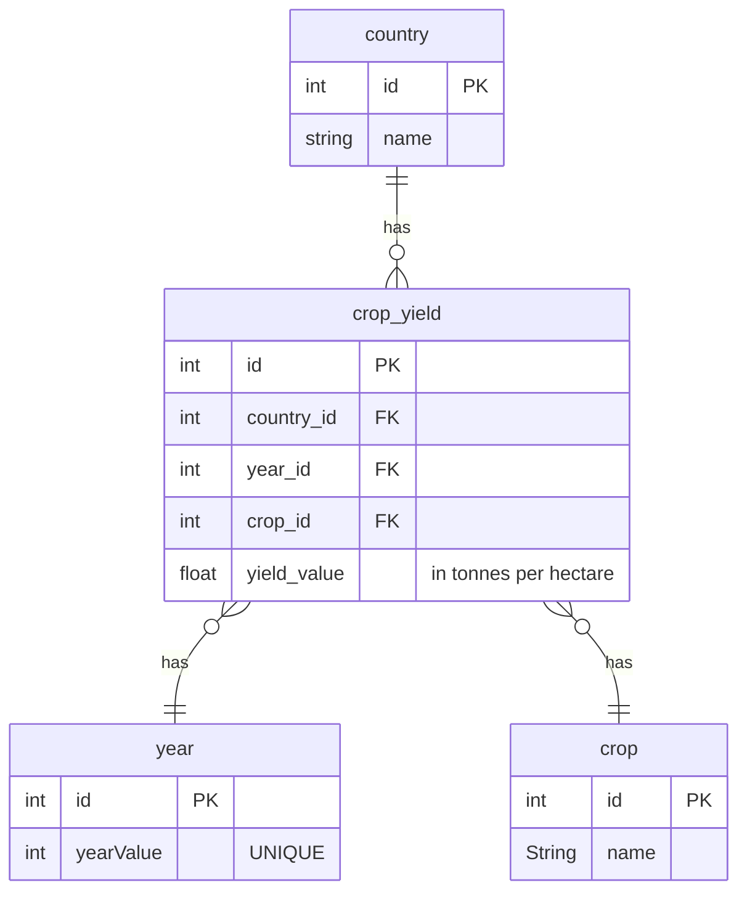

```mermaid
    erDiagram
    
	country {
		int id PK
		string name
	}
	
	year{
		int id PK
		int yearValue "UNIQUE"
	}

	crop{
		int id PK
		String name
	}

	crop_yield{
		int id PK
		int country_id FK
		int year_id FK
		int crop_id FK
		float yield_value "in tonnes per hectare"
		
		
	}

	country ||--o{ crop_yield : has
	crop_yield }o--|| year : has
	crop_yield }o--|| crop: has

```

